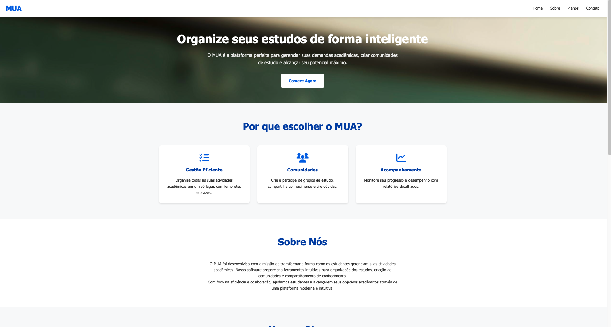
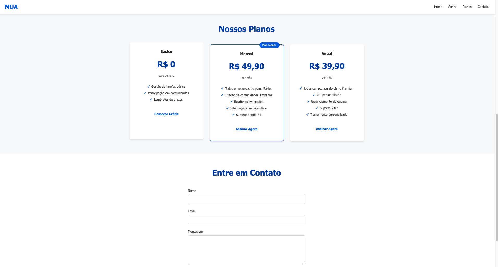
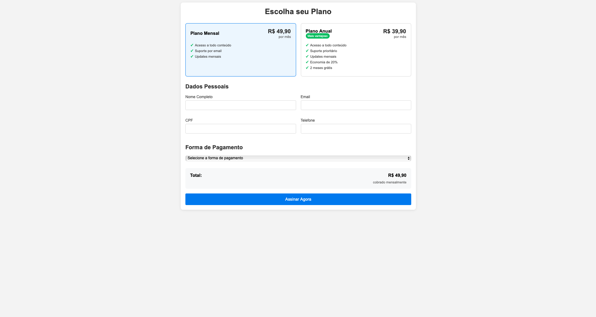

## MUA
---
### Descrição
- MUA foi desenvolvido com a missão de transformar a forma como os estudantes gerenciam suas atividades acadêmicas. Nosso software proporciona ferramentas intuitivas para organização dos estudos, criação de comunidades e compartilhamento de conhecimento.
---
### Funcionalidades
- Criação de contas
- Criação de comunidades
- Criação de tarefas
- Criação de eventos
- Criação de grupos
---
### Linguagens usadas
- JavaScript
- HTML
- CSS
---
## Preview

## Preview Pagamento
